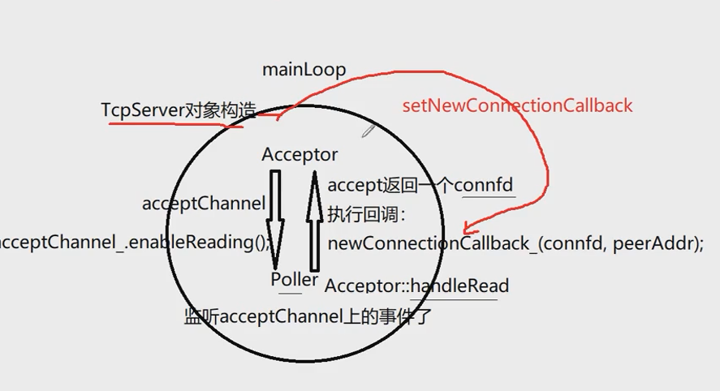
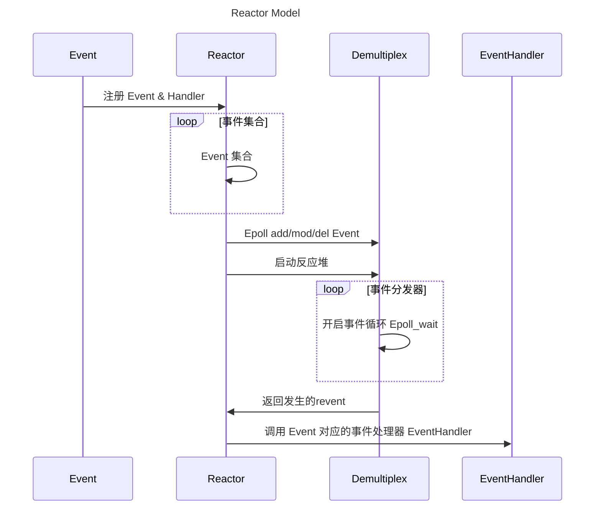

# Rewrite Muduo Library

### TARGET OF REWRITE :

- 完全依赖C++11标准库，舍弃对boost库的依赖，可移植性更强

  

sequenceDiagram
title Reactor Model
participant Event
participant Reactor
participant Demultiplex
participant EventHandler
Event ->> Reactor: 注册 Event & Handler
loop 事件集合
Reactor ->> Reactor: Event 集合
end
Reactor ->> Demultiplex: Epoll add/mod/del Event
Reactor ->> Demultiplex: 启动反应堆
loop 事件分发器
Demultiplex ->> Demultiplex: 开启事件循环 Epoll_wait
end
Demultiplex ->> Reactor: 返回发生的revent
Reactor ->> EventHandler: 调用 Event 对应的事件处理器 EventHandler

## EventLoop

***one loop per thread, one EventLoop includes a Poller and a ChannelList***

- 如何唤醒subLoop？

TcpServer::newConnection() 根据轮询算法选择一个subLoop，ioLoop = Thread::getNextLoop, 如果ioLoop正式当前loop，则runInLoop，否则就queueInLoop向wakeupfd发送8字节的数据，此时各个subloop正在睡眠，也就是阻塞于epoll_wait()，监听到wakeupfd发生事件，就会执行相应的回调操作，这种做法没有加同步队列，也就是mainLoop封装channel放在队列中，供subloop使用，muduo的做法拥有更高的效率，不需要频繁的切换锁

如何解决“粘包”问题

通过Buffer

### Channel

channel update/remove ==> EventLoop updateChannel/removeChannel ==> Poller updateChannel/removeChannel

### Poller

抽象类，不能实例化，不能拷贝构造

ChannelMap <fd, channel*>

#### 为什么要单独建立DefaultPoller.cc来专门实现Poller类的Poller方法

EventLoop 可以通过 Poller() 获取默认的IO复用的具体实现：poll 还是 epoll, 如果在Poller.cc中实现，需要引用 Poller 的派生类PollPoller 和 EpollPoler ，显然不合适的

### Buffer
