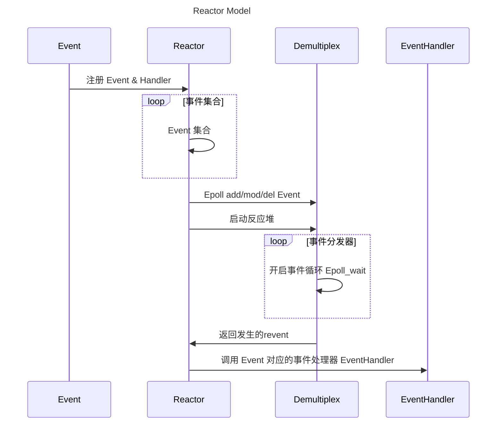

# Rewrite Muduo Library

## EventLoop

***one loop per thread, one EventLoop includes a Poller and a ChannelList***

### Channel

channel update/remove ==> EventLoop updateChannel/removeChannel ==> Poller updateChannel/removeChannel

### Poller

抽象类，不能实例化，不能拷贝构造

ChannelMap <fd, channel*>

#### 为什么要单独建立DefaultPoller.cc来专门实现Poller类的Poller方法

EventLoop 可以通过 Poller() 获取默认的IO复用的具体实现：poll 还是 epoll, 如果在Poller.cc中实现，需要引用 Poller 的派生类PollPoller 和 EpollPoler ，显然不合适的
